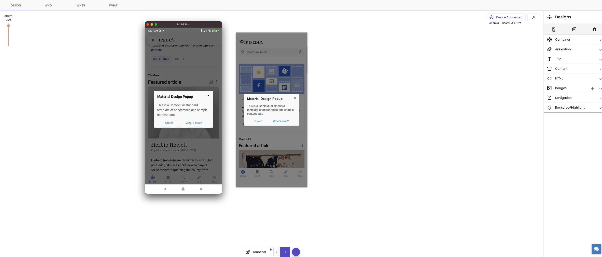
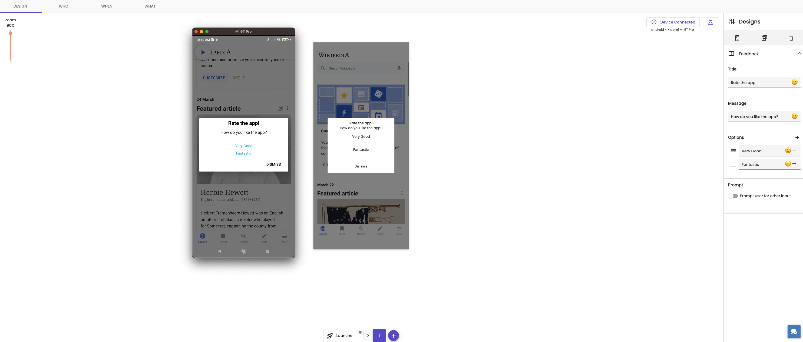

# Pointzi

https://contextu.al/


[](https://twitter.com/contextu_al)


### Wikipedia Android app

This repository contains the source code for the official [Wikipedia Android app](https://play.google.com/store/apps/details?id=org.wikipedia).

### Documentation

All documentation is kept on [our wiki](https://www.mediawiki.org/wiki/Wikimedia_Apps/Team/Android/App_hacking). Check it out!

### Issues

Kindly file issues in [our bug tracker][1]


[1]: https://phabricator.wikimedia.org/maniphest/task/edit/form/10/?title=&projects=wikipedia-android-app-backlog,android-app-bugs&points=1&description=%3D%3D%3D+Steps+to+reproduce%0A%23+%0A%23+%0A%23+%0A%0A%3D%3D%3D+Expected+results%0A%0A%3D%3D%3D+Actual+results%0A%0A%3D%3D%3D+Stack%20trace%0A%60%60%60lines%3D10%0A(Optional%20logcat%20output%20and%20link%20to%20OTRS%20or%20App%20Center)%0A%60%60%60%0A%0A%3D%3D%3D+Environments+observed%0A**App+version%3A+**+%0A**Android+OS+versions%3A**+%0A**Device+model%3A**+%0A**Device+language%3A**


### Contextual Integration
This project is maintained by Contextual and its demonstration how easily you can use Contextual in your application

Contextual Integration can be done by following the documentation [here](https://dashboard.contextu.al/docs/sdks/android/integration/)

To run this application on your device, simply run

```
./gradlew installProdDebug
```

The `app_key` for this app is `Wikipedia`, it can be found in `app/build.gradle`. You may have to change the `app_key` to your
account's `app_key` for the application to work. 


## Screenshots

The following screenshots shows what our SDK can do using the dashboard and live device side by side

Example of PopupModal



Example of NPS Survey


